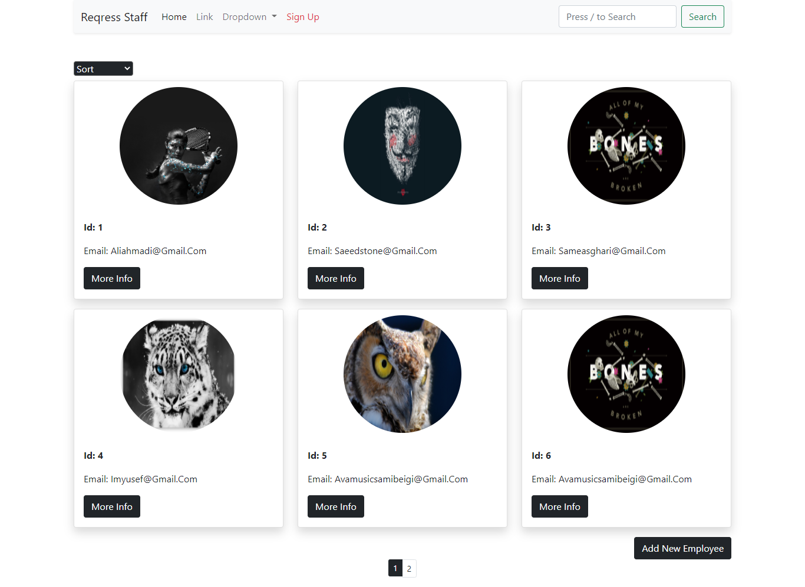
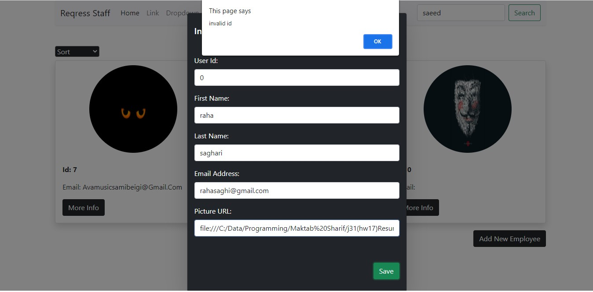
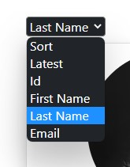
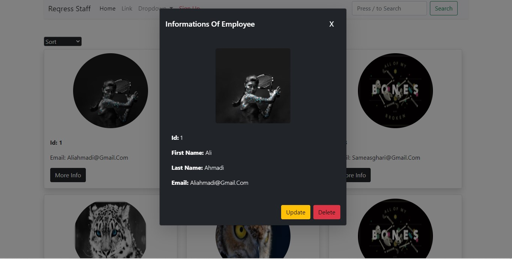
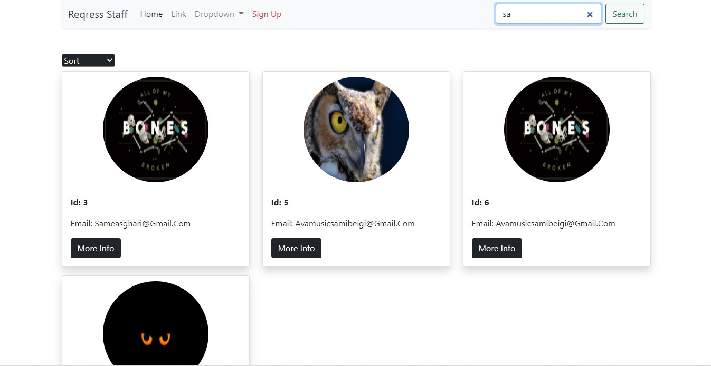
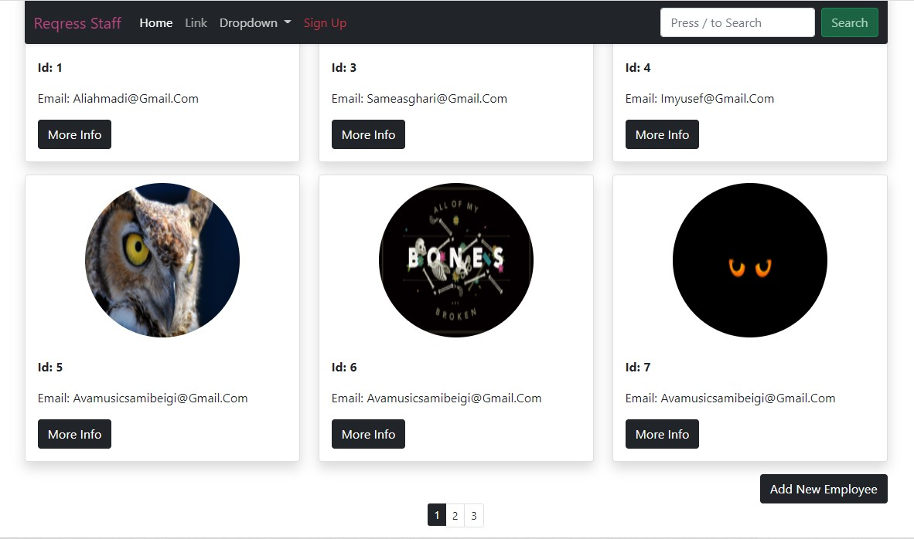

# Reqress_Staff
This single page application is designed react-ish and is a demonstration of using third-party api's which in this case is [reqres.in](reqres.in)

> this app uses Ajax and gets information of staff's on reqress.in, then merges, do some changes to it and finally shows the whole info in a reliable showcase

## Features
- registration of staff  
  
    

- sorting  
you can sort the staff by lots of specifications 

    
- getting full details  
  details are shown in a modal on page which also gives more access to control operations like **Update** and **Delete**
  
  
- proper pagination 
  > the pagination is smart and directs you to proper page on deletion or addition of staffs

  
- **powerfull searching engine**  
  the search engine is totally made by our staff for you and it's very reliable and super fast, and you get results smoothly on page as you are typing 

  

  > special feature in searching gives you easy access to start search by pressing slash "/ " button on keyboard  
  >     
  > 

- Vogue navbar design  
  navbar is sensitive to scroll and changes it's color for better look and more readability

  